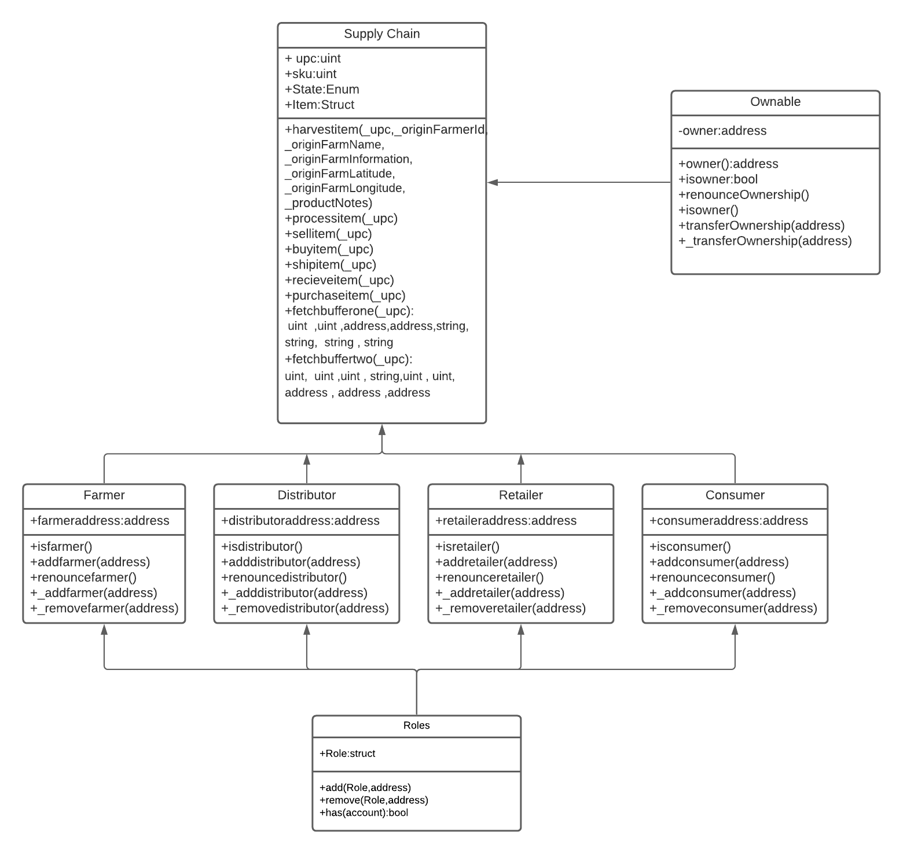

# Supply chain & data auditing

This repository containts an Ethereum DApp that demonstrates a Supply Chain flow between a Seller and Buyer. The user story is similar to any commonly used supply chain process. A Seller can add items to the inventory system stored in the blockchain. A Buyer can purchase such items from the inventory system. Additionally a Seller can mark an item as Shipped, and similarly a Buyer can mark an item as Received.

## General Implementation Data

### Contract Address
Rinkeby-Contract-Address: [0x753D2d1b92a52D8EDE565Da1fFe62B1E23a89121](https://rinkeby.etherscan.io/address/0x753d2d1b92a52d8ede565da1ffe62b1e23a89121)
And The Account address which created it is 0x1E906eebc627e4c49104d4b36A842bBF8Db09a7d


The contract creation Hash is 0xc9e9fb00c0446868b760b41ebe04825c26fa362a9d49a465d66fd9369f83ed42

### Steps / Setup

I have to thank especially Christian Koopmann(https://github.com/ckoopmann) for his front end code and the changes which are mentioned below

I had to do a few changes to the general setup to make the starter code for the frontend application work:
1. Add `web3.min.js` file to the src/js directory
2. Import `truffle-contract` directly using `require` instead of using the provided `truffle-contract.js` which did not work.
3. To be able to use `require` I had to bundle my code using [broswerfy](http://browserify.org/) and source the bundled `src/js/bundle.js` instead of `app.js` directly.

With the above changes I was able to run the app wiht `npm run dev` and call all of the contract functions from the browser using the provided buttons and metamask.

### Versions
Truffle v5.3.10 (core: 5.3.10)


Solidity v0.5.16 (solc-js)

Node v14.17.1


web3: ^0.20.6
 

## Project Writeup
Roles libraries used for creation and deletion of users.

Truffle is used for the development of the smart contracts and testing of the smart contracts..

Solidity is the language used to develop the smart contracts.

Node is used for the development purposes and to install the dependencies required for the project.

web3 is library  used to connect with ethereum  blockchain.

@truffle/hdwallet-provider to sign transactions for addresses.

## IPFS
I did not use IPFS for this project.

## UML
Below are the UML graphs that I created using Lucid Chart. You can find png / xml representations of these graphs in `project-6/uml`

### Activity

### Sequence

### State

### Class


The DApp User Interface when running should look like...


## Getting Started

These instructions will get you a copy of the project up and running on your local machine for development and testing purposes. See deployment for notes on how to deploy the project on a live system.

### Prerequisites

Please make sure you've already installed ganache-cli, Truffle and enabled MetaMask extension in your browser.

```
Give examples (to be clarified)
```

### Installing

A step by step series of examples that tell you have to get a development env running

Clone this repository:

```
git clone https://github.com/udacity/nd1309/tree/master/course-5/project-6
```

Change directory to ```project-6``` folder and install all requisite npm packages (as listed in ```package.json```):

```
cd project-6
npm install
```

Launch Ganache:

```
ganache-cli -m "spirit supply whale amount human item harsh scare congress discover talent hamster"
```

Your terminal should look something like this:


In a separate terminal window, Compile smart contracts:

```
truffle compile
```

Your terminal should look something like this:


This will create the smart contract artifacts in folder ```build\contracts```.

Migrate smart contracts to the locally running blockchain, ganache-cli:

```
truffle migrate
```

Your terminal should look something like this:


Test smart contracts:

```
truffle test
```

All 10 tests should pass.


In a separate terminal window, launch the DApp:

```
npm run dev
```

## Built With

* [Ethereum](https://www.ethereum.org/) - Ethereum is a decentralized platform that runs smart contracts
* [IPFS](https://ipfs.io/) - IPFS is the Distributed Web | A peer-to-peer hypermedia protocol
to make the web faster, safer, and more open.
* [Truffle Framework](http://truffleframework.com/) - Truffle is the most popular development framework for Ethereum with a mission to make your life a whole lot easier.


## Authors

See also the list of [contributors](https://github.com/your/project/contributors.md) who participated in this project.

## Acknowledgments

* Solidity
* Ganache-cli
* Truffle
* IPFS


